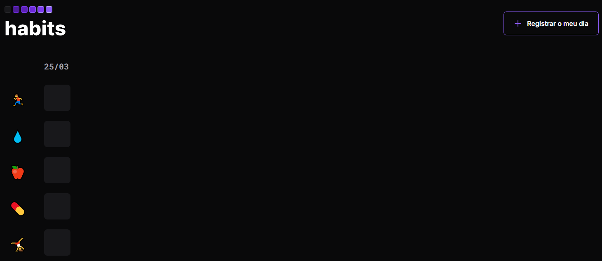

# Habit Tracker Daily



> App web para registrar hábitos diários (correr, água, alimentação...) com check-in por dia e persistência local.

**Demo ao vivo:** https://habittrackerdaily.vercel.app/

## ✨ Features
- [x] Adicionar dia atual com 1 clique
- [x] Check-in por hábito (🏃 💧 🍎 💊 🤸)
- [x] Persistência em localStorage (sem backend)
- [x] Layout responsivo + dark mode
- [ ] Roadmap: backend FastAPI para sincronizar + login

## 🛠️ Stack
HTML5, CSS3, JavaScript Vanilla, NLWSetup (UI calendar), Vercel

## 🚀 Como rodar local
```bash
git clone https://github.com/TadeuN1/habitTracker-project.git
cd habitTracker-project
# só abrir index.html ou
npx serve .
